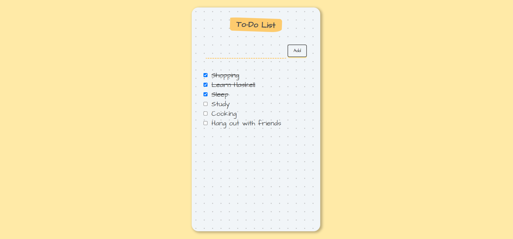

# To-Do List Web App

This is a to-do list web app having a simple and intuitive interface that helps users manage their tasks effectively. Built using HTML, CSS, and React, this web app provides a user-friendly interface for creating, tracking, and organizing the to-do items.

## Features

This website includes the following features:

* **Task Creation:** Users can easily create new tasks by entering them into the input field and pressing Enter or clicking the "Add" button.
* **Task Completion:** Users can mark tasks as completed by clicking the checkbox before each task. Completed tasks are visually indicated, making it easy to track progress.
* **User-Friendly Interface:** The app offers an intuitive and clean interface, making it easy for users to navigate, add tasks, and interact with the task list.
* **Customizability:** The To-Do List Web App can be customized to suit individual preferences and needs. Users can modify the styling, layout, and functionality to create a personalized task management experience.

## Technologies Used

This website is built using the following technologies:

* **HTML:** The app's structure and layout are defined using HTML (Hypertext Markup Language), the standard markup language for creating web pages.
* **CSS:** Cascading Style Sheets (CSS) are used to enhance the visual appearance and styling of the app. CSS provides customization options for fonts, colors, layouts, and more.
* **React:** The app is developed using React, a popular JavaScript library for building user interfaces. React allows for efficient component-based development, making it easier to manage and update the app's UI.

These technologies work together to create a seamless and responsive web application, providing users with an efficient and user-friendly task management experience.

## 🛠 Installation and Setup Instructions

1. git clone https://github.com/tawfik575/todo-web-app.git
2. cd todo-web-app
3. npm install
4. npm start

## Contributing

Contributions to this web application are welcome! If you find a bug or have an idea for an improvement, please submit an issue or create a pull request. Make sure to follow the existing code style and provide detailed information about your changes.

## License

This project is licensed under the MIT License. Feel free to use, modify, and distribute the code as per the terms of the license.

## Contact

If you have any questions, suggestions, or feedback about the project, feel free to contact me at `tawfikbsmrstucse@gmail.com`.